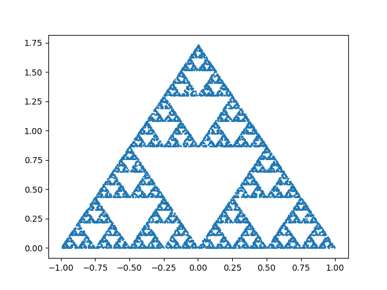
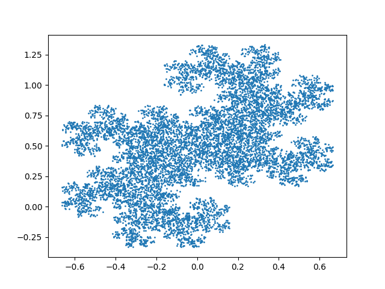
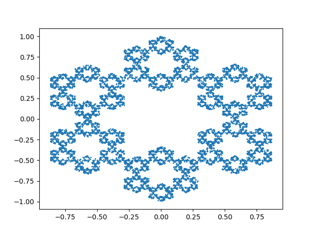

# chaos-games
Implementation of chaos games as described in "Experimental Mathematics in Action"

## Sierpiński triangle
* [Code](./src/sierpinski_triangle.py)

## Twin dragon
* [Code](./src/twin_dragon.py)

## Sierpiński hexagon
* [Code](./src/sierpinski_hexagon.py)

